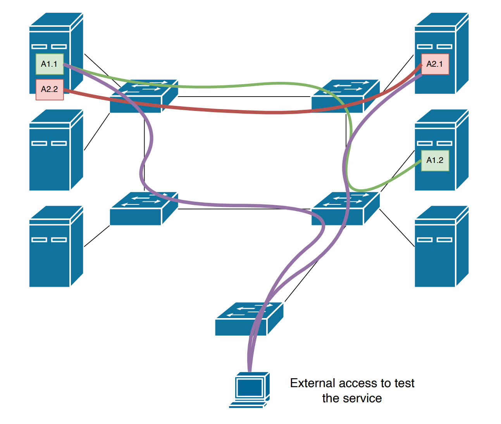

# Project of Next Generation Networks - Automatic deployment of "containers"

> NOTE: to visualize on VSCode this file press `Ctrl+Shift+V` or `Cmd+Shift+V` on Mac

## Steps to execute the project

1. Open VirtualBox and start comnetsemu
2. Opena a terminal and execute the following command:

```bash
production:
python3 ngn_gui.py #  open the GUI and start controller and mininet

dev:
python3 openShellWithPy.py # open terminal and start controller and mininet
```

3. **(Not necessarly - raccomanded on windows system)** Open a terminal and execute the following command :

```bash
sudo su
```

4. Open a terminal and execute the following command:

```bash
cd /media/sf_shared_NGN_Project
```

5. Open a terminal and execute the following command:

```bash
python3 <file_you_want_to_execute>.py
```

## COME ESEGUIRE IL PROGETTO SULLA MACCHINA VIRTUALE

REQUISITI:
- Python 3.7
- Forwarding X11

### INSTALLAZIONE PYTHON 3.7

1. Installazione di Python3.7:

```bash	
sudo apt update
sudo apt install -y python3.7
```

2. Upgrade di pip (per installare poi le librerie necessarie):

```bash	
python3.7 -m ensurepip —upgrade (di solito non funziona)
python3.7 .m pip install —upgrade pip
```

3. Eseguire questi comandi:
	
```bash  
sudo update-alternatives --install /usr/bin/python3 python3 /usr/bin/python3.6 1 
sudo update-alternatives --install /usr/bin/python3 python3 /usr/bin/python3.7 2 
sudo update-alternatives --config python3
```
Selezionare “1” così da scegliere Python 3.6.9 come Python3 di default (fondamentale per far partire mininet)

4. Verificare la corretta installazione di Python3.7:
	
```bash
python3.7 —version
```

5. Verificare la corretta installazione di pip per Python3.7:

```bash
python3.7 -m pip —version
```
Deve restituire qualcosa del tipo: pip X.X.X from /usr/lib/python3.7/site-packages (python 3.7)

6. Per installare eventuali librerie utili per l’esecuzione di programmi, eseguire questo codice:
	
```bash
python3.7 -m pip install nome_libreria
```

### X11 FORWARDING

**MacOS**

Si sfrutta XQuartz per effettuare l’X11 forwarding
Aprire l’applicazione di XQuartz.

1. Aprire un terminale ed eseguire:

```bash
xhost + 127.0.0.1
```
 
2. Accedere in SSH alla macchina virtuale con il comando:

```bash
ssh -Y -p 2222 vagrant@localhost
```

3. Testare il funzionamento dell’X11 forwarding con il comando:

```bash
xclock
```
Se appare sullo schermo un orologio, allora il forwarding funziona correttamente

4. Infine, per eseguire tramite vagrant i file contenuti nella cartella condivisa, è necessario eseguire i seguenti codici:
	
```bash
sudo usermod -aG vboxsf vagrant
```

6. Per verificare che effettivamente vagrant è stato inserito all’interno del gruppo “vboxsf” basta scrivere:
	
```bash
groups vagrant
```
e vedere se tra i vari gruppi presenti c’è anche “vboxsf”

7. A questo punto si può eseguire il file ngn_gui.py tramite il comando:

```bash
python3.7 ngn_gui.py
```

Perchè python3.7 e non python3?
Perchè si vuole fare in modo che la gui venga eseguita con python3.7, mentre il resto con python3.6 in quanto questo è compatibile con mininet.

**Windows**

Si sfrutta mobaXterm per effettuare l’X11 forwarding

1. Creare una nuova sessione SSH inserendo remote host: 127.0.0.1 e verificando che l’X11 forwarding sia attivo nella sezione “Advanced SSH settings”

2. Testare il funzionamento dell’X11 forwarding con il comando:

```bash
xclock
```
Se appare sullo schermo un orologio, allora il forwarding funziona correttamente

3. Infine, per eseguire tramite vagrant i file contenuti nella cartella condivisa, è necessario eseguire i seguenti codici:

```bash
cd ..
cd ..
cd media
sudo usermod -aG vboxsf vagrant
```

4. Per verificare che effettivamente vagrant è stato inserito all’interno del gruppo “vboxsf” basta scrivere:

```bash
groups vagrant
```
e vedere se tra i vari gruppi presenti c’è anche “vboxsf”

5. A questo punto si può eseguire il file ngn_gui.py tramite il comando:

```bash
python3.7 ngn_gui.py
```

Perchè python3.7 e non python3?
Perchè si vuole fare in modo che la gui venga eseguita con python3.7, mentre il resto con python3.6 in quanto questo è compatibile con mininet.

## Description

## Roadmap

1. Isolate traffic between host and server
2. Fixing and improving 

## Requirements

- [x] Creare una repository su GitHub
- [x] Create an SDN network in mininet with multiple switches
- [X] Create a software that is capable of deploying services in the network
  - Services are composed of multiple applications that communicate together to deliver the service (e.g., web server and database)
- [ ] Create a GUI (python recommended) capable of:
  - Deploying service in the network (i.e., starting required applications on existing hosts)
    - Basic idea: choose host depending on usage (e.g., max 2 applications per host)
  - Choose communication requirements for applications
    - E.g., application A needs to communicate with application B
    - Upon choosing requirement, the software automatically configures flows in the switches (keeping track of them, see next point)
  - Stopping applications
    - Upon stopping, remove flows if not required anymore
- [x] Show that applications can actually talk
  - Example of communicating applications are a web server and a database (create fake ones)


