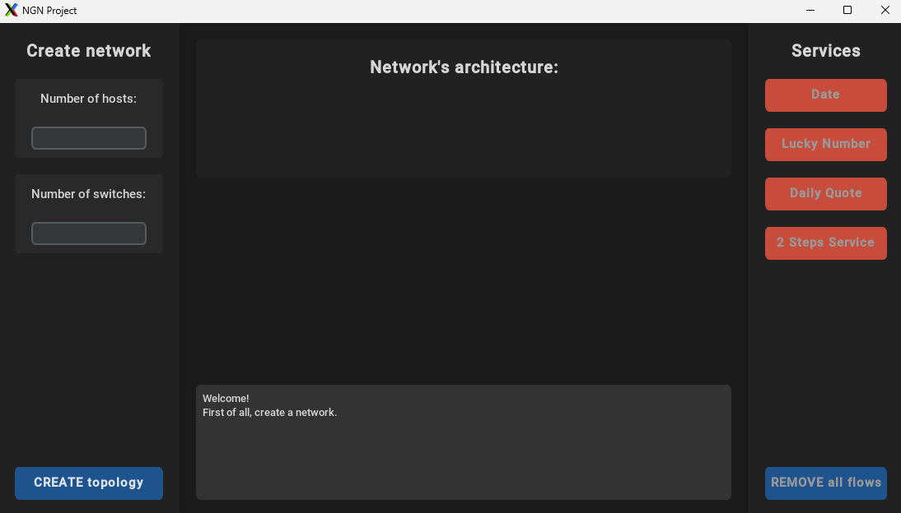
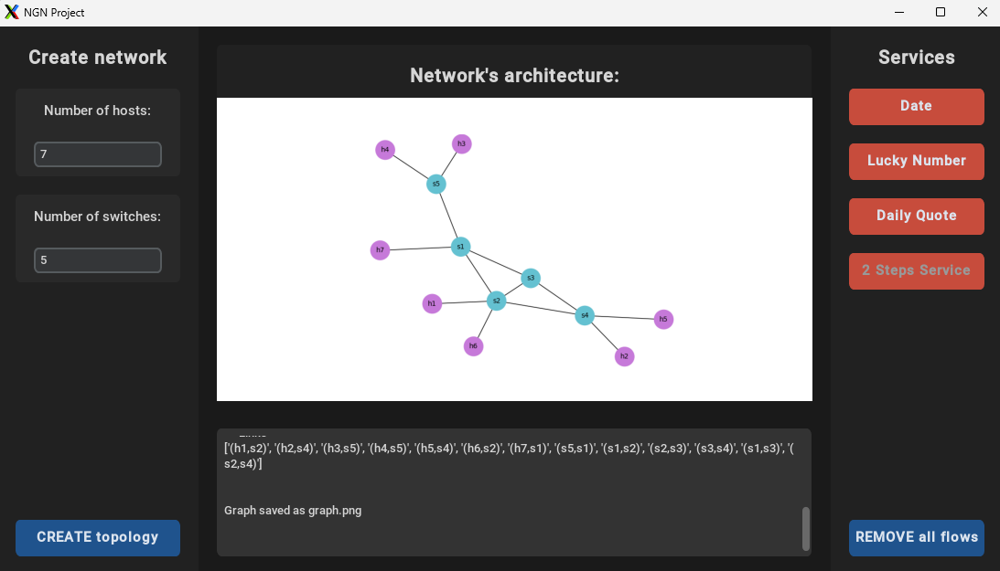
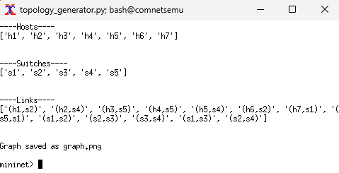

# Next Generation Networks Project - Automatic deployment of "containers" - Berardo C., Castagnaro T., Consolaro J.

> NOTE: to visualize this file on VSCode press `Ctrl+Shift+V` or `Cmd+Shift+V` on Mac

## INTRODUCTION

This project integrates Software-Defined Networking (SDN) with Mininet to dynamically deploy and manage services composed of interconnected applications. A Python-based GUI simplifies interaction and management.

### Key Features

- SDN Network: Simulated multi-switch network in Mininet with centralized flow control via an SDN controller.
- Service Deployment: Deploy and manage multi-application services with automated host selection and flow configuration.
- GUI: Intuitive interface for deploying services, managing flows, and monitoring network activity.
- Dynamic Flow Management: Automatically configure and clean up network flows based on application requirements.

## PREREQUISITES

- Install [Virtualbox](https://www.virtualbox.org/wiki/Downloads) and the [Comnetsemu Virtual Machine](https://drive.google.com/drive/folders/1FP5Bx2DHp7oV57Ja38_x01ABiw3wK11M?usp=sharing)
- Add NGN_Project as a shared folder in Comnetsemu VM settings.
- Connect to the VM via SSH with the following command (***password: vagrant***):

  ```bash
    ssh -X -p 2222 vagrant@localhost
  ```

  and run the following command to access the shared folder with privileges:

  ```bash
    sudo usermod -aG vboxsf vagrant
  ```
  Check if the vboxsf is in the group:

  ```bash
  groups vagrant
  ``` 

- For Mac users : install [_XQuartz_](https://www.xquartz.org/) and [enable forwarding](/Readme_files/X11_setup.md)
- For Windows users: install [_mobaXterm_](https://mobaxterm.mobatek.net/download.html) and [enable forwarding](/Readme_files/X11_setup.md)
- Install [Python 3.7](/Readme_files/Install_Python.md) version on the VIrtual Machine

## FILES WITH DESCRIPTION
1. **ngn_gui.py**: graphical user interface
2. **topology_generator.py**: generates the topology and assign services to servers
3. **topology_parameters.txt**: contains user-input parameters to create the topology
4. **simple_switch_stp_13.py**: contains the ryu controller configuration
5. **openShellWithPy.py**: executes shell scripts on external consoles
6. **Servers folder**: contains configuration files for servers and server's status files, that tell if they are on/off
7. **client.py**: slient configuration file
8. **img Folder**: contains images

## HOW TO RUN THE APPLICATION

1. Open VirtualBox and start Comnetsemu Virtual Machine (comnetsemu)
2. After logging-in, for a better “manageability”, instead of running commands directly into the VM it might be worth to use your own terminal (or MobaXterm for Windows machine) and ssh into the VM. To do so, run (***password: vagrant***): 

   ```bash
     ssh -X -p 2222 vagrant@localhost
   ```

3. Change directory to the shared folder sf_NGN_Project. Under default settings run:
   
   ```bash
     cd /media/sf_NGN_Project
   ```

    3.1. If some permission issues arise, then use the superuser command:

    ```bash
      sudo su
    ```

      and then repeat the previous command.

4. Run the ngn_gui.py program

    ```bash    
      python3.7 ngn_gui.py #  open the GUI and start controller and mininet
    ```

    The program will open the Graphical User Interface and the RYU controller will be turned-on. You should see the following:

    
    

5. Use the textboxes to set the number of hosts and switches. Then press the button "CREATE TOPOLOGY" to generete the Mininet. Wait for the topology image to display
  
    
    

6. Use the right-side buttons to turn on the servers. Once you have turned on the servers, use the mininet command line to request a service by running the client.py program on host1 (h1) specifying the server's IP you want to connect to. The ryu controller will automatically instantiate the required flow between the client and the server.

    

7. To delete all flows press the REMOVE all flows button. This will automatically update the flow tables and delete previously added entries.

## Requirements

- [x] Creare una repository su GitHub
- [x] Create an SDN network in mininet with multiple switches
- [x] Create a software that is capable of deploying services in the network
  - Services are composed of multiple applications that communicate together to deliver the service (e.g., web server and database)
- [X] Create a GUI (python recommended) capable of:
  - Deploying service in the network (i.e., starting required applications on existing hosts)
    - Basic idea: choose host depending on usage (e.g., max 2 applications per host)
  - Choose communication requirements for applications
    - E.g., application A needs to communicate with application B
    - Upon choosing requirement, the software automatically configures flows in the switches (keeping track of them, see next point)
  - Stopping applications
    - Upon stopping, remove flows if not required anymore
- [x] Show that applications can actually talk
  - Example of communicating applications are a web server and a database (create fake ones)


